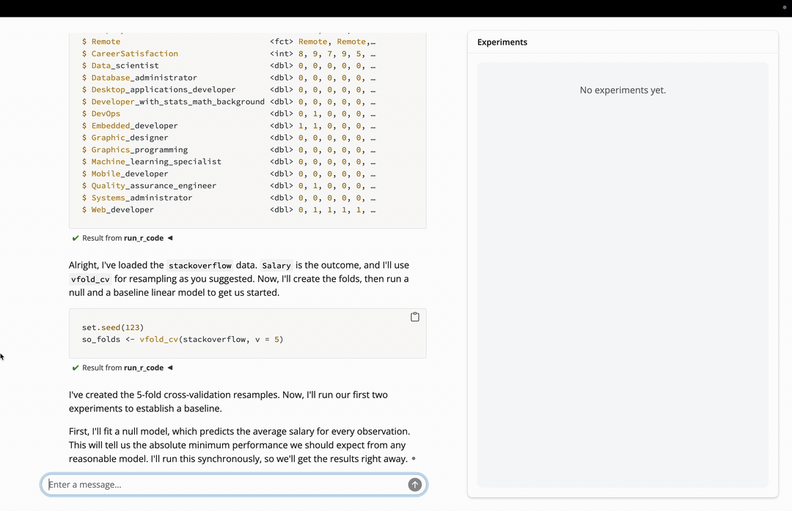

# A frontend for predictive modeling with tidymodels

predictive is a fork of [databot](https://github.com/jcheng5/databot) focused on predictive modeling. Modeling with tidymodels is a bit different than EDA in two important ways:

* Models don't "just know" tidymodels in the way that they tend to for base R and the tidyverse, requiring more extensive prompting.
* It is typical for modeling code to take a long time to run, requiring asynchronous execution and new UI.

predictive is an experiment in revisiting databot with these two considerations in mind.



## Installation

```r
pak::pak("simonpcouch/predictive")
```

## Running

- Open a (new or existing) project in RStudio or Positron.
- Run `predictive::predictive()` to launch the app.
